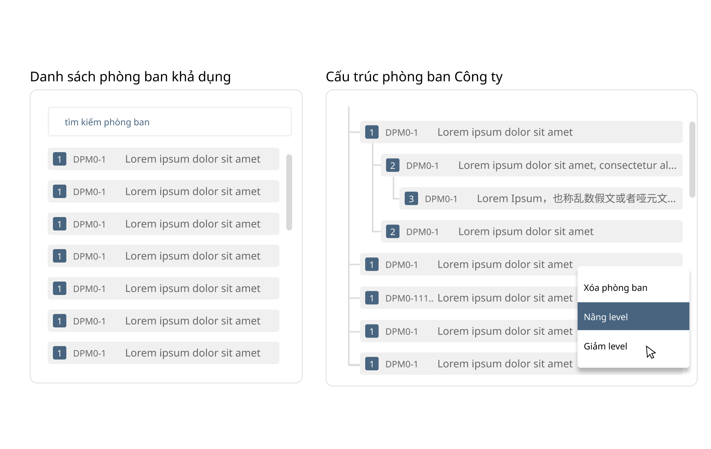

# 006: Drag&Drop

## Giới thiệu:
Bài tập giúp các bạn làm quen với data Object trong VueJs, biến đổi data và emit các event, directive và callback 

## Thực hiện:
Link Design: <https://www.figma.com/file/50HH6rGamqunPOLniC37PK/DragAndDrop?node-id=6%3A495>

### Yêu cầu:
- [ ] Khởi tạo UI/UX giống với link figma
- [ ] thực hiện kéo thả các phòng ban trong cùng 1 danh sách
- [ ] thực hiện kéo thả các phòng ban giữa 2 danh sách khác nhau(dạng list)
- [ ] thực hiện kéo thả các phòng ban từ 1 danh sách(dạng list) vào danh sách dạng sơ đồ cây (dạng tree) với giới hạn 10 tầng, khi kéo update lại level của phòng ban đó
- [ ] thực hiện các option thao tác khi chuột phải vào phòng ban (xóa khỏi cây hiện tại, di chuyển lên trên, di chuyển xuống dưới)
- [ ] Viết unit test cho component (Chức năng thêm - Sẽ thực hiện vào tuần cuối)
- [ ] Đóng gói được component để có thể sử dụng cho App (hoặc có thể build thành thư viện và đưa lên NPM  -  Option)
