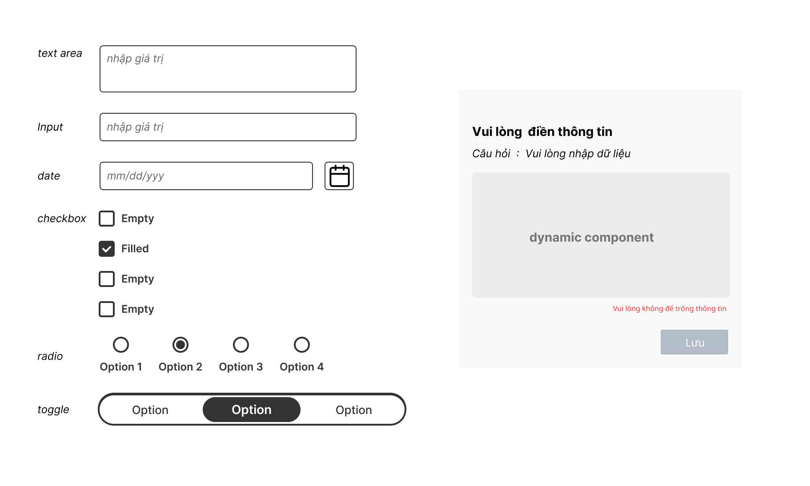

# 004:  Dynamic component  

## Giới thiệu

Bài tập giúp các bạn làm quen dynamic Component, hiểu rõ hơn về vòng đời của vue, 

## Thực hiện

Link Design: <https://www.figma.com/file/50HH6rGamqunPOLniC37PK/DragAndDrop?node-id=6%3A494>

### Yêu cầu

- [ ] Khởi tạo UI/UX giống với link figma
- [ ] thực hiện chuyển đổi kiểu input theo option được chọn ( dạng text, dạng checkbox, dạng radio... )
- [ ] sử dụng keep-Alive với dynamic component 
- [ ] sử dụng emit event, v-bind, props and callback, event Bus cho dynamic component
- [ ] Viết unit test cho component (Chức năng thêm - Sẽ thực hiện vào tuần cuối)
- [ ] Đóng gói được component để có thể sử dụng cho App (hoặc có thể build thành thư viện và đưa lên NPM  -  Option)
