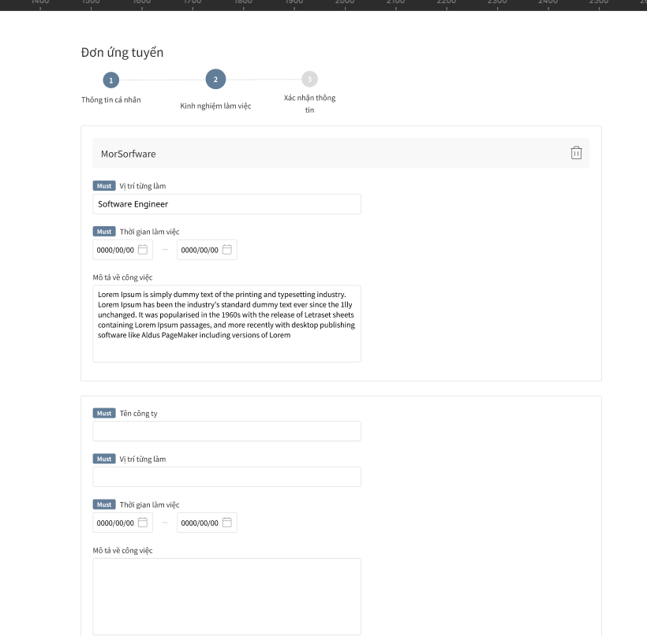
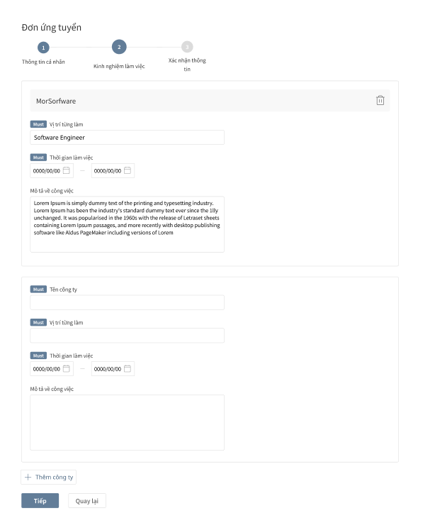
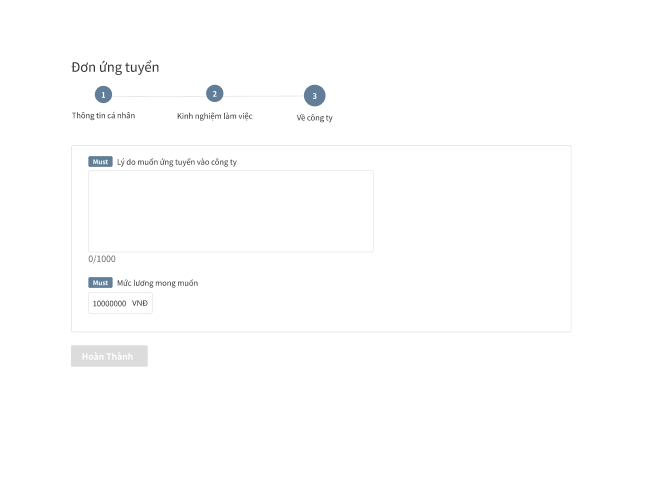

# 003: MultiForm


## Giới thiệu:
Đây là bài tập này sẽ giúp các bạn kết hợp các component đã tạo từ bài 001,002. Trong bài này các bạn sẽ nắm bắt được cách kết hợp các component với nhau để có thể xây dựng thành một app hoàn chỉnh. Ngoài ra sẽ nắm được 1 vài concept cơ bản như Dynamic Component, Step Component





## Thực hiện:
Link Design: https://www.figma.com/file/6N23vLtmdvL19jHlyyMwXl/MultiForm?node-id=0%3A1

### Yêu cầu:
- [ ] Khởi tạo UI/UX giống với link figma
- [ ] Có bắt validate theo từng step ( Ưu cầu validate bằng tay - Không dùng thư viện )
    ```
    Step 1:
    Họ tên: Required, maxLength =< 100
    Ngày sinh: Không cho chọn quá thời gian hiện tại
    Mô tả bản thân: maxLength =< 1000

    Step 2:
    Tối thiểu 1 công ty
        Trong 1 công ty :
        Vị trí từng làm: Required, maxLength =< 100
        Thời gian làm việc : startDate =< endDate , Thời gian KHÔNG ĐƯỢC TRÙNG với thời gian làm ở công ty khác
        Mô tả công việc: maxLength =< 5000

    Step 3:
    Lý do muốn ứng tuyển vào công ty : maxLength =< 1000, required
    Mức lương mong muốn : Phải là số, tối đa được 10 chữ số 
    ```
- [ ] Datepicker có thể dùng thư viện hoặc sẽ tự tạo 1 component ( Có thể dùng thư viện cho nhanh )
- [ ] Có thể render form theo state hoặc JSON cho trước
- [ ] Build component dynamic input
- [ ] Khi nhấn hoàn thành thì log ra đoạn body request để có thể gửi lên api
- [ ] Viết unit test cho component (Chức năng thêm - Sẽ thực hiện vào tuần cuối)
