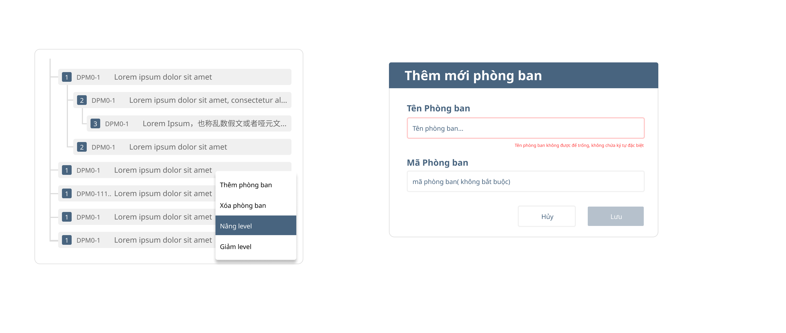

# 004:  Recursive component  

## Giới thiệu

Bài tập giúp các bạn làm quen với đệ quy, thực hiện đệ quy component,  single file component, 

## Thực hiện

Link Design: <https://www.figma.com/file/50HH6rGamqunPOLniC37PK/DragAndDrop?node-id=0%3A1>

### Yêu cầu

- [ ] Khởi tạo UI/UX giống với link figma
- [ ] Thực hiện đệ quy theo sơ đồ cây
- [ ] thực hiện thêm checkbox, collapse/expand, event emits
- [ ] thực hiện thêm/sửa/xóa component bằng cách nhấn chuột phải, vị trí dropdown tại vị trí click chuột, sử dụng eventBus thay emit nhiều tầng
- [ ] Viết unit test cho component (Chức năng thêm - Sẽ thực hiện vào tuần cuối)
- [ ] Đóng gói được component để có thể sử dụng cho App (hoặc có thể build thành thư viện và đưa lên NPM  -  Option)

### tư liệu
data mẫu 

